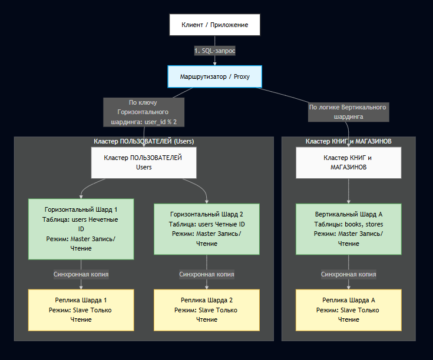

Домашнее задание к занятию «Репликация и масштабирование. Часть 2» - Локтева И.С.

# Задание 1

Опишите основные преимущества использования масштабирования методами:

## активный master-сервер и пассивный репликационный slave-сервер;

В этой конфигурации Master обрабатывает абсолютно все запросы (и чтение, и запись). Slave в это время «молчит», не принимает запросы от пользователей, а только непрерывно копирует (реплицирует) данные с Мастера в фоновом режиме.

Основные преимущества:

* Высокая отказоустойчивость (High Availability): Если основной сервер (Master) сломается или сгорит, пассивный сервер (Slave) можно быстро «повысить» до Мастера, и система продолжит работу.
* Минимальное время простоя (Downtime): Переключение на резервный сервер занимает от нескольких секунд до пары минут.
* 100% актуальная копия данных: У тебя всегда есть свежая копия базы на случай непредвиденных сбоев или порчи данных на основном сервере.
* Простота резервного копирования (Backup): Можно делать бэкапы с пассивного Slave-сервера, вообще не нагружая основной рабочий Master-сервер.

Master + 1 пассивный Slave нужен в основном для безопасности и надежности (чтобы всё не сломалось).

## master-сервер и несколько slave-серверов;

Master-сервер и несколько slave-серверов
Здесь Master принимает только запросы на изменение данных (запись, обновление, удаление — INSERT, UPDATE, DELETE). А все запросы на чтение (вывод информации пользователям — SELECT) распределяются между несколькими Slave-серверами.

Основные преимущества:

* Огромное ускорение чтения (Масштабируемость): Большинство сайтов и приложений 80-90% времени только читают данные (например, просмотр ленты, товаров, каталогов). Разделение чтения на 3, 5 или 10 Slave-серверов позволяет выдерживать миллионы пользователей.
* Разгрузка основного сервера: Master занимается только критически важными операциями записи, его процессор и память не забиты тяжелыми поисковыми запросами.
* Гибкое распределение нагрузки (Load Balancing): Можно направлять разные типы отчетов или аналитики на разные Slave-серверы, чтобы они не мешали обычным пользователям.
* Повышенная живучесть системы: Если один из трех Slave-серверов выйдет из строя, пользователи этого даже не заметят — их запросы на чтение просто автоматически перенаправятся на оставшиеся два Slave-сервера.

Master + много активных Slaves нужен для скорости и мощности (чтобы система не тормозила при огромном наплыве пользователей).

# Задание 2

## 1. Принципы построения системы и разграничение данных 

Для масштабирования этой системы мы применим два принципиально разных подхода: вертикальный шардинг (разделение по функционалу) и горизонтальный шардинг (разделение по строкам).

### Вертикальный шардинг (Vertical Sharding)

Принцип: Мы разделяем базу данных по таблицам (или группам таблиц). Каждая логическая сущность уезжает на свой собственный физический сервер или кластер.

Применение в нашей схеме:Таблица stores (магазины) и таблица books (книги) изолируются друг от друга. Они больше не находятся в одной общей базе данных. Это полностью убирает общую нагрузку на диски и процессор.

### Горизонтальный шардинг (Horizontal Sharding)

Принцип: Мы берем одну огромную таблицу и режем её по строкам на основе специального ключа шардирования (Shard Key). Часть пользователей живет на одном сервере, часть — на другом.

Применение в нашей схеме:
Таблица users (пользователи) является самой быстрорастущей. Мы делим её на два независимых шарда (Shard 1 и Shard 2) по правилу: id % 2. Пользователи с нечетными ID попадают на один сервер, с четными — на другой.

## 2. План выполнения (Пошаговый алгоритм)

### Проектирование схемы и отказ от JOIN: Поскольку таблицы будут физически на разных серверах, делать прямые SQL-запросы со связями (JOIN) между пользователями, книгами и магазинами больше нельзя. Связи теперь обеспечиваются на уровне кода приложения (Application Level).

### Внедрение прокси-слоя (Router): Перед базами данных ставится умный маршрутизатор (например, ProxySQL, Citus для Postgres, или логика внутри самого бэкенд-приложения). Он знает, куда отправлять конкретный запрос.

### Миграция и разделение данных: Данные переносятся на новые выделенные сервера согласно выбранной логике.

## 3. Блок-схема инфраструктуры.

## 4. В каких режимах работают сервера
Чтобы система была не просто масштабируемой, но и отказоустойчивой, каждый шард представляет собой мини-кластер из двух серверов:

Шард А (Книги и Магазины - Вертикальный):

### Master-сервер: Находится в режиме Active (Read/Write). Приложение записывает новые книги и новые магазины только сюда.

### Slave-сервер: Находится в режиме Standby (Read-Only). Он непрерывно реплицирует данные с Master. Если Master падает, Slave автоматически переключается в режим Master.

Шард 1 (Пользователи 1..3..5.. - Горизонтальный):

### Master-сервер: Режим Active (Read/Write) для нечетных ID пользователей.

### Slave-сервер: Режим Standby (Read-Only) для подстраховки первого шарда и разгрузки тяжелых отчетов по пользователям.

Шард 2 (Пользователи 2..4..6.. - Горизонтальный):

### Master-сервер: Режим Active (Read/Write) для четных ID пользователей.

### Slave-сервер: Режим Standby (Read-Only) для подстраховки второго шарда.

Структура таблиц для примера (произвольные столбцы):
users (id [PK], name, email, registration_date) — Шардирована горизонтально.
books (id [PK], title, author, price) — Шардирована вертикально.
stores (id [PK], store_name, address, phone) — Шардирована вертикально.

# SQL-скрипт

-- =========================================================================
-- ЧАСТЬ 1: КЛАСТЕР ПОЛЬЗОВАТЕЛЕЙ (Выполняется на Шарде 1 и Шарде 2)
-- =========================================================================

-- Создание таблицы пользователей
CREATE TABLE users (
    user_id BIGINT NOT NULL,          -- Уникальный ID (будет использоваться как Shard Key)
    username VARCHAR(50) NOT NULL,    -- Имя или никнейм пользователя
    email VARCHAR(100) NOT NULL,      -- Электронная почта
    password_hash VARCHAR(255) NOT NULL, -- Хэш пароля для безопасности
    created_at TIMESTAMP DEFAULT CURRENT_TIMESTAMP, -- Дата и время регистрации
    
    PRIMARY KEY (user_id),
    CONSTRAINT uk_user_email UNIQUE (email) -- Почта должна быть уникальной
);

-- =========================================================================
-- ЧАСТЬ 2: КЛАСТЕР КНИГ И МАГАЗИНОВ (Выполняется на Шарде А)
-- =========================================================================

-- Создание таблицы книг
CREATE TABLE books (
    book_id BIGINT NOT NULL,          -- Уникальный ID книги
    title VARCHAR(255) NOT NULL,      -- Название книги
    author VARCHAR(150) NOT NULL,     -- Автор
    isbn VARCHAR(13) NOT NULL,        -- Международный книжный номер
    price DECIMAL(10, 2) NOT NULL,    -- Стоимость книги (формат 000.00)
    
    PRIMARY KEY (book_id),
    CONSTRAINT uk_book_isbn UNIQUE (isbn) -- ISBN уникален для каждой книги
);

-- Создание таблицы магазинов
CREATE TABLE stores (
    store_id INT NOT NULL,            -- Уникальный ID магазина
    name VARCHAR(100) NOT NULL,       -- Название филиала
    address VARCHAR(255) NOT NULL,    -- Физический адрес
    phone VARCHAR(20),                -- Номер телефона (может быть пустым)
    
    PRIMARY KEY (store_id)
);

-- =========================================================================
-- ДОПОЛНИТЕЛЬНО: ТАБЛИЦА СВЯЗЕЙ (ЗАКАЗЫ) 
-- (Обычно шардируется так же, как и пользователи, по user_id)
-- =========================================================================

CREATE TABLE orders (
    order_id BIGINT NOT NULL,         -- Уникальный ID самого заказа
    user_id BIGINT NOT NULL,          -- ID покупателя (логическая связь с users)
    book_id BIGINT NOT NULL,          -- ID книги (логическая связь с books)
    store_id INT NOT NULL,            -- ID магазина (логическая связь с stores)
    order_date TIMESTAMP DEFAULT CURRENT_TIMESTAMP, -- Дата покупки
    
    PRIMARY KEY (order_id)
);

