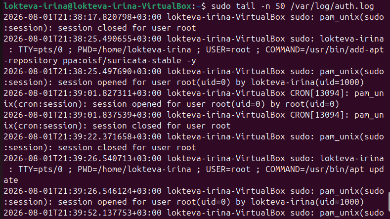
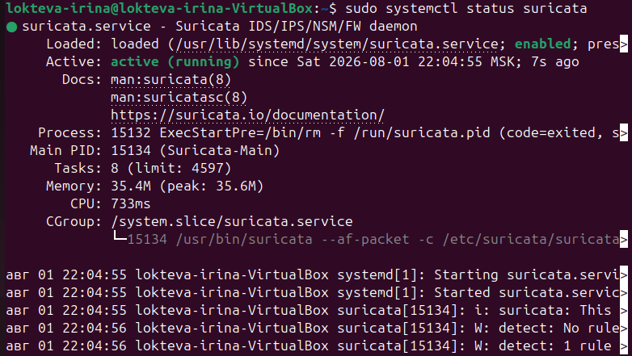
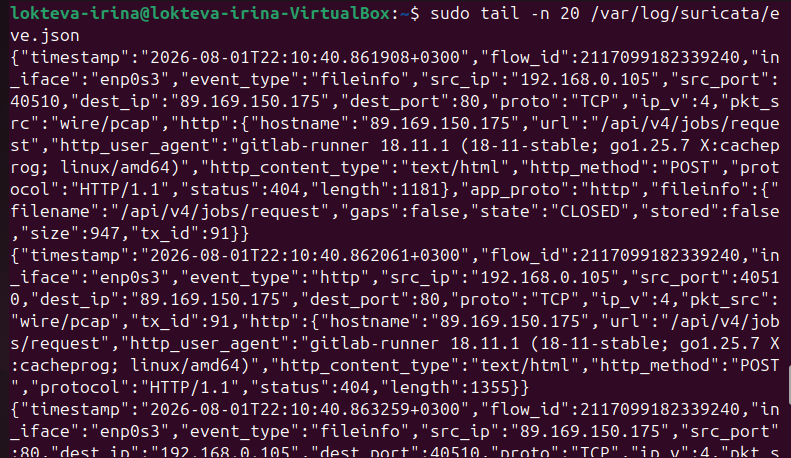

Домашнее задание к занятию «Защита сети» - `Локтева И.С.`

# Задание 1

## Результаты разведки (сканирования)

С атакующей системы злоумышленника (Metasploitable, IP: 192.168.0.106) было выполнено сетевое сканирование защищаемого узла Ubuntu (IP: 192.168.0.105) в четырех регламентированных режимах:
* sudo nmap -sA — сканирование с установленным флагом ACK для анализа правил фильтрации брандмауэра.
* sudo nmap -sT — сканирование методом установления полного трехэтапного TCP-соединения (TCP Connect).
* sudo nmap -sS — полуоткрытое скрытное SYN-сканирование (Stealth SYN Scan).
* sudo nmap -sV — сканирование для определения версий и типов запущенных сетевых служб.

## Анализ событий в логах систем защиты 

### Журнал Fail2Ban (journalctl -u fail2ban):
В ходе проведения разведки утилитой nmap служба Fail2Ban не зафиксировала деструктивных событий и не применила блокировок. Это является абсолютно штатным и корректным поведением данной СЗИ.

### Журнал Suricata (/var/log/suricata/eve.json / fast.log):
В отличие от Fail2Ban, система обнаружения вторжений (IDS) Suricata работает на сетевом и транспортном уровнях (L3/L4), поэтому она успешно зафиксировала аномальную сетевую активность.

 