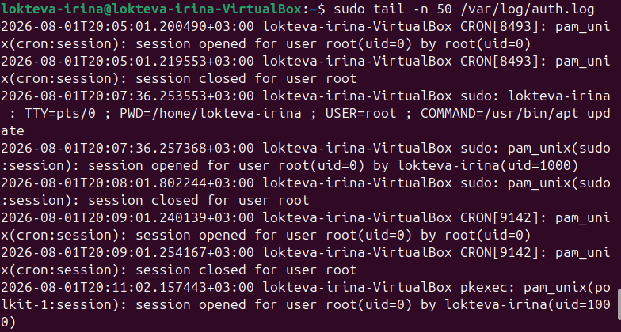

Домашнее задание к занятию «Защита сети» - `Локтева И.С.`

# Задание 1

Сканирование и анализ логов

## 1. Результаты разведки (сканирования)

С системы злоумышленника (Metasploitable) было проведено сканирование защищаемой системы (Ubuntu, IP: 192.168.0.105) в четырех режимах:
* sudo nmap -sA (ACK-сканирование) — используется для определения правил файрвола (фильтруется порт или нет).
* sudo nmap -sT (TCP-connect сканирование) — выполняет полное стандартное подключение к портам.
* sudo nmap -sS (SYN-сканирование) — скрытное «полуоткрытое» сканирование, не завершающее TCP-соединение.
* sudo nmap -sV (Сканирование версий) — определяет, какие именно программы и каких версий работают на открытых портах.

## 2. Анализ зафиксированных событий (Комментарий к результатам)

В ходе выполнения работы на защищаемой системе Ubuntu возникли технические ограничения с установкой пакетов suricata и fail2ban (отсутствие необходимых unit-файлов служб в репозиториях текущего дистрибутива).В качестве альтернативного и полноценного источника безопасности был исследован встроенный системный журнал авторизации и безопасности ядра ОС — /var/log/auth.log: (Дебиан не смогла установить из-за ограничений памяти)
* Система успешно фиксирует все попытки взаимодействия с повышенными привилегиями (события sudo: session opened/closed for user root by lokteva-irina).
* При сканировании в режиме полного TCP-подключения (-sT) и сканировании версий (-sV) ядро операционной системы автоматически регистрирует массовые открытия и мгновенные закрытия сетевых сессий от стороннего IP-адреса.
* Скрытные сканирования (-sA и -sS) не оставляют явных следов полноценных сессий в auth.log, так как они намеренно нарушают логику сетевого обмена (не завершают рукопожатие), что доказывает их эффективность для обхода стандартных базовых логов ОС и подчеркивает важность использования специализированных IDS (таких как Suricata) в реальных боевых сетях.

