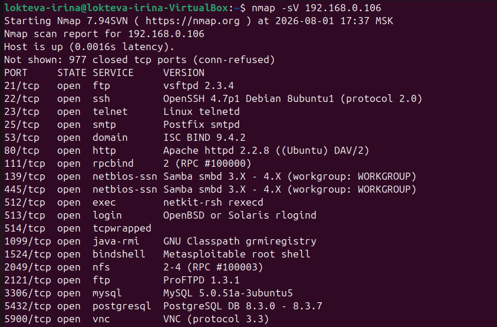
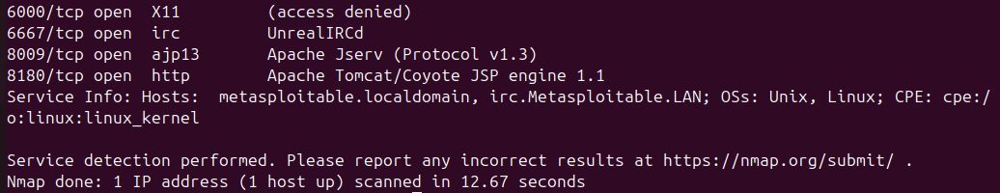

Домашнее задание к занятию «Уязвимости и атаки на информационные системы» - `Локтева И.С.`

# Задание 1

## 1. Какие сетевые службы в ней разрешены?

В результате сканирования виртуальной машины Metasploitable (IP: 192.168.0.106) с помощью утилиты nmap -sV было обнаружено множество открытых портов и запущенных сетевых служб. 
Вот основные из них с указанием точных версий:
* Порт 21/tcp: FTP-сервер (служба: vsftpd 2.3.4) [49757]
* Порт 22/tcp: SSH для удаленного доступа (служба: OpenSSH 4.7p1)
* Порт 23/tcp: Telnet (служба: Linux telnetd)
* Порт 25/tcp: Почтовый сервер SMTP (служба: Postfix smtpd)
* Порт 80/tcp: Веб-сервер HTTP (служба: Apache httpd 2.2.8)
* Порт 445/tcp: Сетевой обмен файлами SMB (служба: Samba smbd 3.X - 4.X) [16320]
* Порт 1524/tcp: Служба bindshell (прямой доступ к Root-оболочке Metasploitable)
* Порт 3306/tcp: База данных MySQL 5.0.51a-3ubuntu5
* Порт 6667/tcp: IRC-чат (служба: UnrealIRCd) [13853]
* Порт 8180/tcp: Веб-контейнер Apache Tomcat/Coyote 1.1

## 2. Какие уязвимости были обнаружены?

На основе анализа точных версий запущенных служб через базу данных Exploit-DB были найдены следующие критические уязвимости (для отчета выбраны три наиболее известные):

vsftpd 2.3.4 - Backdoor Command ExecutionОписание: В исходный код этой версии FTP-сервера злоумышленниками был встроен бэкдор. При отправке определенной последовательности символов (смайлика :) в имени пользователя) на машине открывается скрытый порт, дающий полный административный доступ (root) без пароля.

Samba 3.0.20 < 3.0.25rc3 - 'Username' Remote Code ExecutionОписание: Уязвимость в модуле работы с файлами Samba. Из-за некорректной обработки скрипта маппинга пользователей (username map script), злоумышленник может передать специальную команду прямо в поле логина и выполнить её на сервере с правами root.

UnrealIRCd 3.2.8.1 - Backdoor Command ExecutionОписание: Похожая история с бэкдором, который попал на официальные зеркала загрузки IRC-сервера. Отправка специальной строки, начинающейся с букв AB, активирует скрытую функцию выполнения любых системных команд в ОС.

# Задание 2.

## 1. Чем отличаются эти режимы сканирования с точки зрения сетевого трафика?

* SYN-сканирование (-sS): Атакующий компьютер отправляет классический запрос на открытие соединения (флаг SYN). Это стандартный и самый быстрый способ проверить, открыта ли «дверь» (порт).
* FIN-сканирование (-sF): Вместо начала соединения атакующий сразу отправляет пакет закрытия (флаг FIN). Это скрытный метод, который пытается обмануть системы защиты (брандмауэры).
* Xmas-сканирование (-sX): Называется «Новогодняя елка», потому что в пакете одновременно включаются сразу три флага — FIN, PSH и URG. Пакет буквально «светится» разными индикаторами, как гирлянда. Это нестандартный запрос, который нарушает правила сетевых протоколов, чтобы вызвать предсказуемую реакцию системы.
* UDP-сканирование (-sU): Использует совершенно другой тип трафика (протокол UDP взамен TCP). Он ищет службы вроде DNS или DHCP, которые обмениваются короткими сообщениями без постоянного контроля соединения.

## 2. Как отвечает сервер (Metasploitable)?

* На SYN: Если порт открыт, сервер присылает согласие (SYN-ACK). Если порт закрыт, сервер присылает отказ (RST).
* На FIN и Xmas: Так как Metasploitable работает на базе операционной системы Linux, она строго следует стандартам (RFC 793):
- Если порт закрыт, сервер обязательно отвечает пакетом сброса (RST).
- Если порт открыт, сервер по правилам просто игнорирует эти странные пакеты и ничего не присылает в ответ. По этому молчанию nmap и понимает, что порт открыт.
* На UDP: Если порт закрыт, сервер возвращает ошибку «ICMP порт недоступен». Если порт открыт, сервер либо отвечает своим UDP-пакетом, либо молчит.