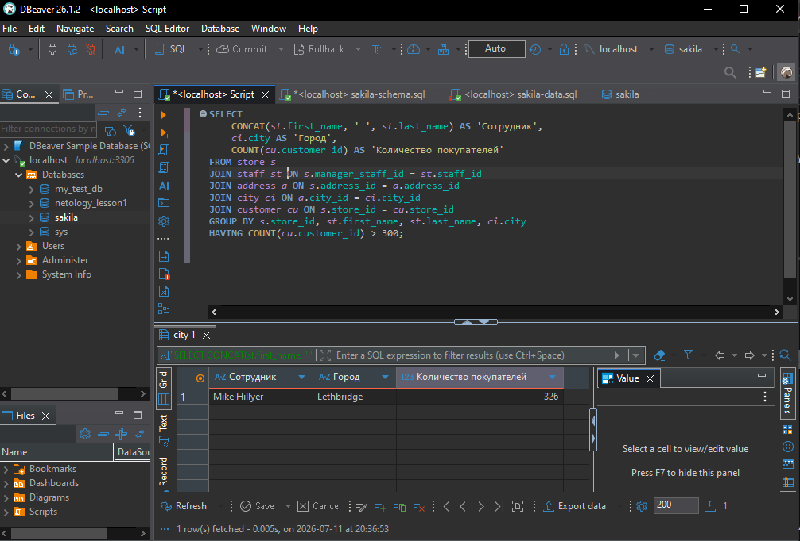
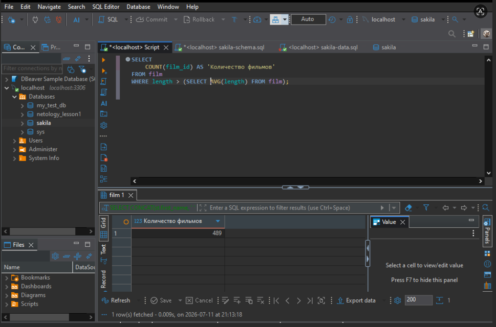
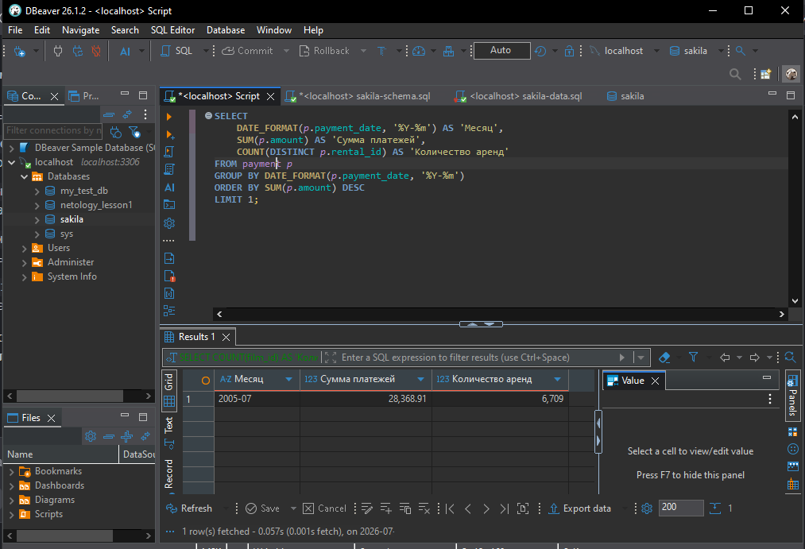

Домашнее задание к занятию «SQL. Часть 2» `Локтева И.С.`

###Задание 1

SELECT 
    CONCAT(st.first_name, ' ', st.last_name) AS 'Сотрудник',
    ci.city AS 'Город',
    COUNT(cu.customer_id) AS 'Количество покупателей'
FROM store s
JOIN staff st ON s.manager_staff_id = st.staff_id
JOIN address a ON s.address_id = a.address_id
JOIN city ci ON a.city_id = ci.city_id
JOIN customer cu ON s.store_id = cu.store_id
GROUP BY s.store_id, st.first_name, st.last_name, ci.city
HAVING COUNT(cu.customer_id) > 300;

###Задание 2

SELECT 
    COUNT(film_id) AS 'Количество фильмов'
FROM film
WHERE length > (SELECT AVG(length) FROM film);

###Задание 3

SELECT 
    DATE_FORMAT(p.payment_date, '%Y-%m') AS 'Месяц',
    SUM(p.amount) AS 'Сумма платежей',
    COUNT(DISTINCT p.rental_id) AS 'Количество аренд'
FROM payment p
GROUP BY DATE_FORMAT(p.payment_date, '%Y-%m')
ORDER BY SUM(p.amount) DESC
LIMIT 1;

